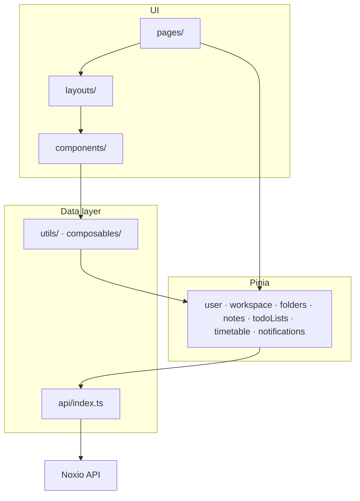

# Noxio (frontend)

Web client for **Noxio** — a Notion-style workspace app: folders, notes, tasks, workspaces, and EduPage integration. The UI follows a familiar sidebar + main content layout.

OpenAPI spec for the backend: [`api-1.json`](./api-1.json).

## Screenshots

### Home


### Note editor


### Todo list


---

## Features

| Area | Status |
|------|--------|
| **Auth** | Register, login, 2FA, password recovery |
| **Workspaces** | Create/switch, members, invitations |
| **Folders & notes** | Folder CRUD, note list, block-based editor with autosave |
| **Todo / Kanban** | Task lists, Kanban board with drag-and-drop (TODO / IN_PROGRESS / DONE) |
| **EduPage** | Connect account, timetable sync, lesson display |
| **Notifications** | Per-workspace notification list |
| **Search** | Workspace-wide search |
| **Media** | Backend ready; image upload UI not yet wired |
| **Settings** | Route exists; UI not yet implemented |
| **Noxio AI** | Placeholder |

---

## Stack

- [Vue 3](https://vuejs.org/) + [TypeScript](https://www.typescriptlang.org/) ~5.9
- [Vite](https://vite.dev/) 8
- [Vue Router](https://router.vuejs.org/) 4
- [Pinia](https://pinia.vuejs.org/) 3
- [Axios](https://axios-http.com/) 1.x
- [Tailwind CSS](https://tailwindcss.com/) 4 (`@tailwindcss/vite`)

---

## Architecture

Single-page app: Vue Router for navigation, Pinia stores for server state, one Axios instance for HTTP (JWT + refresh on 401).



| `src/` folder | Role |
|---------------|------|
| `pages/` | Route screens (auth, dashboard, edupage) |
| `layouts/` | Dashboard shell, sidebar |
| `components/` | Reusable UI (notes, sidebar, dashboard, todo) |
| `stores/` | API calls and cached entities |
| `composables/` | Shared logic (e.g. editor draft, resizable split) |
| `api/` | Axios client |
| `config/api.ts` | `VITE_API_BASE_URL` |
| `types/`, `utils/` | Models and helpers |
| `router/` | Route definitions |
| `assets/` | Global styles and icons |

---

## Prerequisites

- **Node.js** 20+ (Docker build uses Node 22)
- **npm** 10+
- Running **Noxio API** (base URL in `.env`)

---

## Environment

```bash
cp .env.example .env
```

```env
VITE_API_BASE_URL=https://YOUR_BASE_URL
```

Required at build/dev time (`src/config/api.ts`). Access token: `localStorage` key `access_token`; refresh via `POST /auth/refresh` on 401.

---

## Local development

```bash
npm install
npm run dev
```

Open **http://localhost:5173**.

Production build and preview:

```bash
npm run build
npm run preview
```

`VITE_API_BASE_URL` must be set before `npm run build` (Vite inlines env at build time).

---

## Frontend routes

| Path | Purpose |
|------|---------|
| `/` | Redirect to `/auth/login` |
| `/auth/login`, `/auth/register` | Sign in / sign up |
| `/auth/verify` | 2FA |
| `/auth/forgot-password`, `/auth/reset-password` | Password recovery |
| `/auth/edupage`, `/auth/edupage/login` | EduPage connection |
| `/dashboard` | App shell → `/dashboard/home` |
| `/dashboard/home` | Home — upcoming deadlines + timetable |
| `/dashboard/folders` | Folder grid |
| `/dashboard/folders/:folderId/notes/:noteId?` | Notes + block editor |
| `/dashboard/todo` | Todo list overview |
| `/dashboard/todo/:todoListId` | Kanban board for a todo list |
| `/dashboard/noxio-ai` | Noxio AI (placeholder) |
| `/dashboard/settings` | Settings (placeholder) |

---

## Note editor

Block-based editor on `/dashboard/folders/:folderId/notes/:noteId`:

- **Block types:** paragraph, bulleted list (nested)
- **Formatting:** bold, text size (small / medium / large)
- **Autosave** with conflict detection via `contentVersion`
- Split-panel layout: note list on the left, editor on the right

---

## Todo / Kanban

Task management on `/dashboard/todo` and `/dashboard/todo/:todoListId`:

- **Todo lists** with name, description, and color label
- **Kanban board** with three columns: `TODO`, `IN_PROGRESS`, `DONE`
- Drag-and-drop between columns (position synced to API)
- Task fields: title, description, deadline, category
- Deadline filter: today / week / month

---

## EduPage integration

Connect via `/auth/edupage` → `/auth/edupage/login`. After linking:

- Timetable lessons are fetched and cached in the `timetable` store
- Lessons appear on the Home page alongside upcoming task deadlines

---

## Images & media (planned UI)

Backend endpoints already exist in `api-1.json`.

| Method | Route | Summary |
|--------|-------|---------|
| `POST` | `/media/upload` | Upload file (`multipart/form-data`, max **10 MB**, JPEG / PNG / WebP / GIF / SVG) |
| `GET` | `/workspaces/{workspaceId}/media` | List media in workspace |
| `GET` | `/media/{mediaId}` | Get media metadata + `fileUrl` |
| `DELETE` | `/media/{mediaId}` | Delete media |

`POST /media/upload` returns `data.id`, `data.fileUrl`, `data.type`. Media `type` values:

- `NOTE_ATTACHMENT` — images for notes (attachments / cover)
- `USER_AVATAR` — profile picture
- `WORKSPACE_AVATAR` — workspace icon

Notes expose `coverMediaId` on `GET /notes/{noteId}`; the upload + link flow is not yet wired in the UI.

---

## API client

- Module: [`src/api/index.ts`](./src/api/index.ts)
- Base URL: `import.meta.env.VITE_API_BASE_URL`
- Header: `Authorization: Bearer <token>`

---

## Docker

From repository root:

```bash
docker build -f docker/Dockerfile -t notion-fe .
docker run --rm -p 8080:80 notion-fe
```

App at **http://localhost:8080**. Set `VITE_API_BASE_URL` at **image build** time if the API host differs from dev.

CI: [`.gitlab-ci.yml`](./.gitlab-ci.yml) (`APP_NAME`: `noxio-fe`). Compose files in `docker/dev/` and `docker/local/` are environment-specific.

---

## npm scripts

| Script | Description |
|--------|-------------|
| `npm run dev` | Vite dev server |
| `npm run build` | Typecheck + production build |
| `npm run preview` | Serve `dist/` locally |

---

## VS Code

If Tailwind `@apply` triggers unknown-at-rule warnings:

```json
{
  "css.lint.unknownAtRules": "ignore",
  "scss.lint.unknownAtRules": "ignore"
}
```

---

## Repository layout

```
notion-fe/
├── src/
├── docker/
├── docs/               # README screenshots
├── api-1.json
├── .env.example
└── package.json
```
