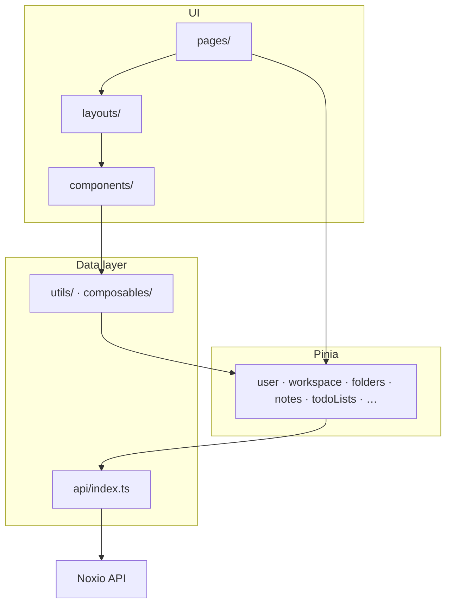

# Noxio (frontend)

Web client for **Noxio** — a Notion-style workspace app: folders, notes, tasks, workspaces, and EduPage integration. The UI follows a familiar sidebar + main content layout.

OpenAPI spec for the backend: [`api-1.json`](./api-1.json).

## Screenshots

### Home


### Note editor


### Todo list


---

## Features

| Area | Status |
|------|--------|
| **Auth** | Register, login, 2FA, password recovery |
| **Workspaces** | Create/switch, members, invitations |
| **Folders & notes** | Folder CRUD, note list, block-based note editor |
| **Todo** | Task lists today; **Kanban board planned** for `/dashboard/todo` |
| **EduPage** | Connect account and timetable sync |
| **Media** | Backend ready; image UI in notes/settings **coming soon** (see [Images & media](#images--media-planned-ui)) |

The app includes a **note editor** (open a note under `folders/:folderId/notes/:noteId`) with autosave to the API.

---

## Stack

- [Vue 3](https://vuejs.org/) + [TypeScript](https://www.typescriptlang.org/)
- [Vite](https://vite.dev/) 8
- [Vue Router](https://router.vuejs.org/) 4
- [Pinia](https://pinia.vuejs.org/) 3
- [Axios](https://axios-http.com/)
- [Tailwind CSS](https://tailwindcss.com/) 4 (`@tailwindcss/vite`)

---

## Architecture

Single-page app: Vue Router for navigation, Pinia stores for server state, one Axios instance for HTTP (JWT + refresh on 401).



| `src/` folder | Role |
|---------------|------|
| `pages/` | Route screens (auth, dashboard, edupage) |
| `layouts/` | Dashboard shell, sidebar |
| `components/` | Reusable UI (notes, sidebar, dashboard) |
| `stores/` | API calls and cached entities |
| `composables/` | Shared logic (e.g. editor draft, resizable split) |
| `api/` | Axios client |
| `config/api.ts` | `VITE_API_BASE_URL` |
| `types/`, `utils/` | Models and helpers |
| `router/` | Route definitions |
| `assets/` | Global styles and icons |

---

## Prerequisites

- **Node.js** 20+ (Docker build uses Node 22)
- **npm** 10+
- Running **Noxio API** (base URL in `.env`)

---

## Environment

```bash
cp .env.example .env
```

```env
VITE_API_BASE_URL=https://YOUR_BASE_URL
```

Required at build/dev time (`src/config/api.ts`). Access token: `localStorage` key `access_token`; refresh via `POST /auth/refresh` on 401.

---

## Local development

```bash
npm install
npm run dev
```

Open **http://localhost:5173**.

Production build and preview:

```bash
npm run build
npm run preview
```

`VITE_API_BASE_URL` must be set before `npm run build` (Vite inlines env at build time).

---

## Frontend routes

| Path | Purpose |
|------|---------|
| `/` | Redirect to `/auth/login` |
| `/auth/login`, `/auth/register` | Sign in / sign up |
| `/auth/verify` | 2FA |
| `/auth/forgot-password`, `/auth/reset-password` | Password recovery |
| `/auth/edupage`, `/auth/edupage/login` | EduPage |
| `/dashboard` | App shell → `/dashboard/home` |
| `/dashboard/home` | Home |
| `/dashboard/folders` | Folders |
| `/dashboard/folders/:folderId/notes/:noteId?` | Notes + editor |
| `/dashboard/todo` | Tasks (Kanban planned) |
| `/dashboard/noxio-ai` | Noxio AI placeholder |
| `/dashboard/settings` | Settings |

---

## Images & media (planned UI)

Below is what the frontend will call, based on backend routes in `api-1.json`.

### Upload & library

| Method | Route | Summary |
|--------|-------|---------|
| `POST` | `/media/upload` | Upload file (`multipart/form-data`, max **10 MB**, JPEG / PNG / WebP / GIF / SVG) |
| `GET` | `/workspaces/{workspaceId}/media` | List media in workspace |
| `GET` | `/media/{mediaId}` | Get media metadata + `fileUrl` |
| `DELETE` | `/media/{mediaId}` | Delete media |

`POST /media/upload` returns `data.id`, `data.fileUrl`, `data.type`, etc. Media `type` values:

- `NOTE_ATTACHMENT` — images for notes (attachments / cover)
- `USER_AVATAR` — profile picture
- `WORKSPACE_AVATAR` — workspace icon

### Profile avatar (planned: Settings)

| Method | Route | Summary |
|--------|-------|---------|
| `POST` | `/media/upload` | Upload with `type=USER_AVATAR` |
| `PATCH` | `/auth/me/avatar` | Body: `{ "mediaId": "…" }` — attach uploaded media |
| `DELETE` | `/auth/me/avatar` | Remove avatar |

### Note images (planned: note header / cover)

Notes expose `coverMediaId` on `GET /notes/{noteId}` (and related responses). Planned flow:

1. `POST /media/upload` with `type=NOTE_ATTACHMENT` and workspace context.
2. Link returned `id` to the note as cover (when `PATCH /notes/{noteId}` supports `coverMediaId` on the backend).
3. Render image from `GET /media/{mediaId}` → `fileUrl`.

Related note routes already used by the editor:

| Method | Route | Summary |
|--------|-------|---------|
| `GET` | `/notes/{noteId}` | Note + content + `coverMediaId` |
| `PATCH` | `/notes/{noteId}` | Update `title` / `content` (increments `contentVersion`) |
| `POST` | `/notes/{noteId}/open` | Mark note opened |

### Todo / Kanban (planned)

Task APIs under `/workspaces/{workspaceId}/todo-lists`, `/todo-lists/{todoListId}/tasks`, etc. Tasks include a `status` field suitable for columns. The **Kanban view** on `/dashboard/todo` will map columns to statuses and use existing task create/update endpoints.

---

## API client

- Module: [`src/api/index.ts`](./src/api/index.ts)
- Base URL: `import.meta.env.VITE_API_BASE_URL`
- Header: `Authorization: Bearer <token>`

---

## Docker

From repository root:

```bash
docker build -f docker/Dockerfile -t notion-fe .
docker run --rm -p 8080:80 notion-fe
```

App at **http://localhost:8080**. Set `VITE_API_BASE_URL` at **image build** time if the API host differs from dev.

CI: [`.gitlab-ci.yml`](./.gitlab-ci.yml) (`APP_NAME`: `noxio-fe`). Compose files in `docker/dev/` and `docker/local/` are environment-specific.

---

## npm scripts

| Script | Description |
|--------|-------------|
| `npm run dev` | Vite dev server |
| `npm run build` | Typecheck + production build |
| `npm run preview` | Serve `dist/` locally |

---

## VS Code

If Tailwind `@apply` triggers unknown-at-rule warnings:

```json
{
  "css.lint.unknownAtRules": "ignore",
  "scss.lint.unknownAtRules": "ignore"
}
```

---

## Repository layout

```
notion-fe/
├── src/
├── docker/
├── docs/               # README screenshots
├── api-1.json
├── .env.example
└── package.json
```
