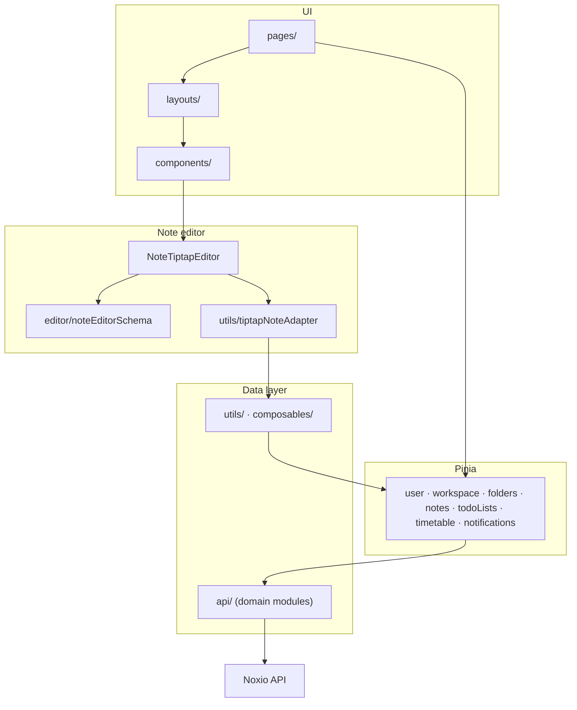

# Noxio (frontend)

Web client for **Noxio** — a Notion-style workspace app: folders, notes, tasks, workspaces, and EduPage integration. The UI follows a familiar sidebar + main content layout.

OpenAPI spec for the backend: [`api-1.json`](./api-1.json).

## Screenshots

### Home


### Note editor


### Todo list


---

## Features

| Area | Status |
|------|--------|
| **Auth** | Register, login, 2FA, password recovery |
| **Workspaces** | Create/switch, members, invitations |
| **Folders & notes** | Folder CRUD, note list, TipTap block editor with autosave and conflict handling |
| **Todo / Kanban** | Task lists, Kanban board with drag-and-drop (TODO / IN_PROGRESS / DONE) |
| **EduPage** | Connect account, timetable sync, lesson display |
| **Notifications** | Per-workspace notification list |
| **Search** | Workspace-wide search |
| **Media** | Avatar upload in Settings (profile + workspace); note attachments / cover not yet wired |
| **Settings** | Profile, security (2FA, password, delete account), workspace management; EduPage tab is UI-only |
| **Noxio AI** | Placeholder |

---

## Stack

- [Vue 3](https://vuejs.org/) + [TypeScript](https://www.typescriptlang.org/) ~5.9
- [Vite](https://vite.dev/) 8
- [Vue Router](https://router.vuejs.org/) 4
- [Pinia](https://pinia.vuejs.org/) 3
- [Axios](https://axios-http.com/) 1.x
- [TipTap](https://tiptap.dev/) 3 (ProseMirror-based note editor)
- [Tailwind CSS](https://tailwindcss.com/) 4 (`@tailwindcss/vite`)

---

## Architecture

Single-page app: Vue Router for navigation, Pinia stores for server state, one Axios instance for HTTP (JWT + refresh on 401).



| `src/` folder | Role |
|---------------|------|
| `pages/` | Route screens (auth, dashboard, settings, edupage) |
| `layouts/` | Dashboard shell, sidebar |
| `components/` | Reusable UI (`ui/`, notes, sidebar, dashboard, settings, todo) |
| `stores/` | API calls and cached entities |
| `composables/` | Shared logic (`useNoteEditorDraft`, `useResizableSplit`, …) |
| `editor/` | TipTap schema, block drag handle, multi-block selection |
| `api/` | Axios instance + domain modules (`auth`, `notes`, `media`, …) |
| `config/api.ts` | `VITE_API_BASE_URL` |
| `types/`, `utils/` | Models, note content helpers, TipTap adapter |
| `router/` | Route definitions |
| `assets/` | Global styles and icons |

---

## Prerequisites

- **Node.js** 20+ (Docker build uses Node 22)
- **npm** 10+
- Running **Noxio API** (base URL in `.env`)

---

## Environment

```bash
cp .env.example .env
```

```env
VITE_API_BASE_URL=https://YOUR_BASE_URL
```

Required at build/dev time (`src/config/api.ts`). Access token: `localStorage` key `access_token`; refresh via `POST /auth/refresh` on 401.

---

## Local development

```bash
npm install
npm run dev
```

Open **http://localhost:5173**.

Production build and preview:

```bash
npm run build
npm run preview
```

`VITE_API_BASE_URL` must be set before `npm run build` (Vite inlines env at build time).

---

## Frontend routes

| Path | Purpose |
|------|---------|
| `/` | Redirect to `/auth/login` |
| `/auth/login`, `/auth/register` | Sign in / sign up |
| `/auth/verify` | 2FA |
| `/auth/forgot-password`, `/auth/reset-password` | Password recovery |
| `/auth/edupage`, `/auth/edupage/login` | EduPage connection |
| `/dashboard` | App shell → `/dashboard/home` |
| `/dashboard/home` | Home — upcoming deadlines + timetable |
| `/dashboard/folders` | Folder grid |
| `/dashboard/folders/:folderId/notes/:noteId?` | Notes + block editor |
| `/dashboard/todo` | Todo list overview |
| `/dashboard/todo/:todoListId` | Kanban board for a todo list |
| `/dashboard/noxio-ai` | Noxio AI (placeholder) |
| `/dashboard/settings` | Settings shell → `/dashboard/settings/profile` |
| `/dashboard/settings/profile` | Profile name and avatar |
| `/dashboard/settings/security` | Password, 2FA toggle, delete account |
| `/dashboard/settings/workspace` | Workspace name, avatar, members, invitations |
| `/dashboard/settings/edupage` | EduPage credentials (UI placeholder) |

---

## Note editor

TipTap-based block editor on `/dashboard/folders/:folderId/notes/:noteId`. The UI model (`NoteBlock[]`) matches the API; TipTap is the editing surface and is bridged by `tiptapNoteAdapter.ts`.

### Block model

| Type | API `type` | Notes |
|------|------------|-------|
| Paragraph | `paragraph` | `size`: `small` \| `medium` \| `large`; `spans[]` with inline marks |
| Bulleted list | `bulleted-list` | Nested `items[]` with `id`, `size`, `spans`, optional `children` |

### Editing features

- **Inline formatting:** bold, underline, text color (preset palette)
- **Block size:** small / medium / large via bottom toolbar
- **Lists:** type `- ` at paragraph start to create a bullet; Enter on an empty item exits the list; Backspace at item start converts to paragraph
- **Drag-and-drop:** reorder top-level blocks via right-side handle (pointer-based, preserves block type and size)
- **Multi-block selection** and **undo/redo** (TipTap history)
- **Limit:** max 500 top-level blocks per note

### Save flow

`useNoteEditorDraft` manages local draft state:

1. Debounced autosave (**600 ms**) via `notes` store → `PATCH /notes/{id}`
2. One automatic retry (**2 s**) on retriable errors (network / 5xx)
3. **Conflict detection:** if `contentVersion` changes on the server while the draft is dirty, a banner offers *keep editing* or *accept remote version*
4. Flush on note switch and component unmount

### Key files

| File | Role |
|------|------|
| `components/notes/NoteEditorPanel.vue` | Title field, editor, toolbar, conflict UI |
| `components/notes/editor/NoteTiptapEditor.vue` | TipTap instance and toolbar state |
| `editor/noteEditorSchema.ts` | Custom ProseMirror nodes + keyboard rules |
| `editor/blockDragHandle.ts` | Block reorder plugin |
| `utils/tiptapNoteAdapter.ts` | `NoteBlock[]` ↔ TipTap JSON |
| `composables/useNoteEditorDraft.ts` | Draft, autosave, conflict handling |

Split-panel layout: note list on the left, editor on the right (`NotesSplitLayout`, resizable via `useResizableSplit`).

---

## Todo / Kanban

Task management on `/dashboard/todo` and `/dashboard/todo/:todoListId`:

- **Todo lists** with name, description, and color label
- **Kanban board** with three columns: `TODO`, `IN_PROGRESS`, `DONE`
- Drag-and-drop between columns (position synced to API)
- Task fields: title, description, deadline, category
- Deadline filter: today / week / month

---

## EduPage integration

Connect via `/auth/edupage` → `/auth/edupage/login`. After linking:

- Timetable lessons are fetched and cached in the `timetable` store
- Lessons appear on the Home page alongside upcoming task deadlines

---

## Settings

Nested routes under `/dashboard/settings` with a left nav (`SettingsNav`):

| Tab | Implemented |
|-----|-------------|
| **Profile** | Edit name/surname; upload avatar (`USER_AVATAR` via `api/media.ts`) |
| **Security** | Change password, enable/disable 2FA (OTP popup), delete account |
| **Workspace** | Rename workspace, upload icon (`WORKSPACE_AVATAR`), member list, role changes, invitations (admin only) |
| **EduPage** | Static UI only — backend credential update not wired yet |

---

## Images & media

Backend endpoints in `api-1.json`; frontend module: [`src/api/media.ts`](./src/api/media.ts).

| Method | Route | Summary |
|--------|-------|---------|
| `POST` | `/media/upload` | Upload file (`multipart/form-data`, max **10 MB**, JPEG / PNG / WebP / GIF / SVG) |
| `GET` | `/workspaces/{workspaceId}/media` | List media in workspace |
| `GET` | `/media/{mediaId}` | Get media metadata + `fileUrl` |
| `DELETE` | `/media/{mediaId}` | Delete media |

`POST /media/upload` accepts `type`:

- `USER_AVATAR` — profile picture (**wired** in Settings → Profile)
- `WORKSPACE_AVATAR` — workspace icon (**wired** in Settings → Workspace)
- `NOTE_ATTACHMENT` — note attachments / cover (**not yet wired** in note editor)

Notes expose `coverMediaId` on `GET /notes/{noteId}`; linking uploaded media to notes is still pending.

---

## API client

- Axios instance: [`src/api/index.ts`](./src/api/index.ts)
- Base URL: `import.meta.env.VITE_API_BASE_URL` (see `src/config/api.ts`)
- Auth header: `Authorization: Bearer <token>` from `localStorage` key `access_token`
- **401 handling:** single in-flight refresh via `POST /auth/refresh`; failed refresh redirects to `/auth/login`
- Domain modules: `auth`, `user`, `workspaces`, `folders`, `notes`, `todoLists`, `taskCategories`, `media`, `notifications`, `search`, `timetable`, `integrations/edupage`

### UI kit

Shared form primitives in `src/components/ui/`:

- `BaseInput` — label, error state, password visibility toggle
- `BaseButton` — loading/disabled state
- `FormMessage` — inline success/error feedback

---

## Docker

From repository root:

```bash
docker build -f docker/Dockerfile -t notion-fe .
docker run --rm -p 8080:80 notion-fe
```

App at **http://localhost:8080**. Set `VITE_API_BASE_URL` at **image build** time if the API host differs from dev.

CI: [`.gitlab-ci.yml`](./.gitlab-ci.yml) (`APP_NAME`: `noxio-fe`). Compose files in `docker/dev/` and `docker/local/` are environment-specific.

---

## npm scripts

| Script | Description |
|--------|-------------|
| `npm run dev` | Vite dev server |
| `npm run build` | Typecheck + production build |
| `npm run preview` | Serve `dist/` locally |

---

## VS Code

If Tailwind `@apply` triggers unknown-at-rule warnings:

```json
{
  "css.lint.unknownAtRules": "ignore",
  "scss.lint.unknownAtRules": "ignore"
}
```

---

## Repository layout

```
notion-fe/
├── src/
│   ├── api/            # Axios client + domain API modules
│   ├── assets/         # Global CSS, icons
│   ├── components/     # ui/, notes/, dashboard/, settings/, sidebar/, …
│   ├── composables/    # useNoteEditorDraft, useResizableSplit, …
│   ├── config/         # API base URL
│   ├── editor/         # TipTap schema, drag handle, selection
│   ├── layouts/
│   ├── pages/          # auth/, dashboard/, edupage/
│   ├── router/
│   ├── stores/         # Pinia stores
│   ├── types/
│   └── utils/          # noteContent, tiptapNoteAdapter, …
├── docker/
├── docs/               # README screenshots
├── api-1.json          # OpenAPI spec
├── .env.example
└── package.json
```
